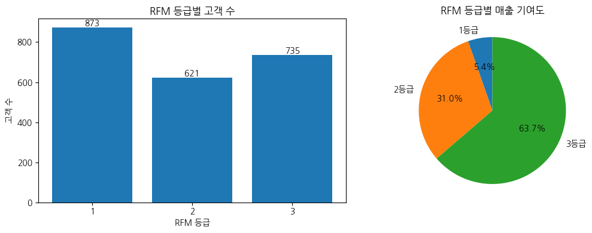
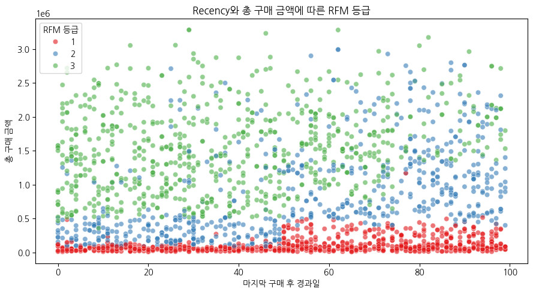
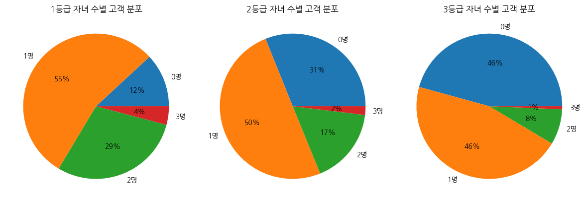

# RFM 고객 세분화 분석

온라인 고객 데이터를 RFM 기준으로 세분화하고, 고객군별 구매 특징과 마케팅 활용 방향을 정리한 프로젝트입니다.

## 분석 목표

이 프로젝트에서는 다음 질문을 확인했습니다.

1. 최근 구매일, 구매 횟수, 구매 금액을 기준으로 고객을 어떻게 구분할 수 있는가?
2. 어느 고객군이 매출에 가장 크게 기여하는가?
3. 고객군별 품목, 구매 채널, 할인 구매, 프로모션 반응에는 어떤 차이가 있는가?

## 데이터와 전처리

- 데이터: 캐글 데이터
- 원본 고객 수: 2,240명
- 최종 분석 고객 수: 2,229명
- 사용 도구: Python, Pandas, Matplotlib, Seaborn, Jupyter Notebook

연 소득 결측값 24개는 평균으로 대체했습니다. 2023년을 기준으로 나이를 계산한 뒤 115세 이상 고객 3명을 제외했고, 연 소득은 IQR 범위를 벗어난 고객 8명을 제거했습니다.

총 구매 금액은 6개 품목의 구매 금액을 합해 계산했습니다. 구매 빈도는 웹 구매와 매장 구매 횟수의 합으로 정의했습니다. 할인 구매 횟수는 채널 구매와 중복될 가능성이 있어 RFM 산식에서는 제외하고 고객 성향 분석에 따로 사용했습니다.

## RFM 점수 계산

| 지표 | 정의 | 점수 방향 |
| --- | --- | --- |
| Recency | 마지막 구매 후 경과일 | 짧을수록 높은 점수 |
| Frequency | 웹 구매 횟수 + 매장 구매 횟수 | 많을수록 높은 점수 |
| Monetary | 전체 품목 구매 금액의 합 | 클수록 높은 점수 |

각 지표는 `pd.qcut`으로 4개 구간을 만들고 1~4점을 부여했습니다. Recency는 경과일이 짧을수록 높은 점수를 받도록 라벨 순서를 반대로 설정했습니다.


Recency 등급별 매출 비중은 24.0~27.2%로 차이가 작았습니다. 반면 Frequency 4등급은 매출의 41.4%, Monetary 4등급은 61.4%를 차지했습니다. 이 차이를 반영해 최종 점수에는 Recency 0.2, Frequency 0.4, Monetary 0.4의 가중치를 적용했습니다.

## 고객 세분화 결과

가중 RFM 점수를 동일한 간격의 3개 구간으로 나누어 1~3등급으로 구분했습니다.



3등급은 전체 고객의 33.0%지만 매출의 63.7%를 차지했습니다. 반대로 1등급은 고객 수가 가장 많지만 매출 비중은 5.4%였습니다. 고객 수만 비교하는 것보다 고객당 구매 규모를 함께 보는 것이 중요합니다.

| RFM 등급 | 고객 수 | 고객 비중 | 매출 비중 | 평균 Recency | 평균 구매 횟수 | 평균 구매 금액 |
| ---: | ---: | ---: | ---: | ---: | ---: | ---: |
| 1등급 | 873명 | 39.2% | 5.4% | 54.7일 | 5.0회 | 약 10.8만 원 |
| 2등급 | 621명 | 27.9% | 31.0% | 53.7일 | 10.4회 | 약 87.5만 원 |
| 3등급 | 735명 | 33.0% | 63.7% | 38.6일 | 15.4회 | 약 152.0만 원 |



3등급에는 구매 금액이 크고 최근 구매일이 비교적 가까운 고객이 많이 포함됐습니다. 다만 구매 금액이 크면서 Recency가 긴 고객도 있어, 이 고객들은 재구매 유도 대상을 선정할 때 별도로 살펴볼 필요가 있습니다.

## 고객군별 구매 성향

### 품목별 매출 구성



등급이 높아질수록 주류 매출 비중이 커졌습니다. 주류 비중은 1등급 41.9%, 3등급 51.3%였습니다. 반면 잡화 비중은 1등급 16.6%에서 3등급 6.2%로 낮아졌습니다.

### 구매 채널과 할인 구매


모든 등급에서 매장 구매 횟수가 웹 구매보다 많았습니다. 할인 구매 횟수는 2등급이 평균 2.66회로 가장 높아 RFM 등급과 단순히 비례하지 않았습니다. 따라서 할인 반응은 RFM 점수와 별개의 성향으로 보는 편이 적절합니다.

### 프로모션 참여율


3등급은 대부분의 프로모션에서 참여율이 높았습니다. 특히 프로모션 6의 참여율은 3등급에서 23.1%로 가장 높았습니다. 프로모션 3은 등급별 차이가 작아 비교적 넓은 고객군이 반응한 프로모션으로 볼 수 있습니다.

## 마케팅 활용 방향

- 3등급: 주류 관련 혜택과 VIP 캠페인을 우선 검토합니다.
- 2등급: 할인 반응을 활용해 상위 등급 전환 캠페인을 검토합니다.
- 구매 금액이 크지만 Recency가 긴 고객: 재구매 유도 캠페인 대상으로 별도 관리합니다.

## 파일 구성

```text
.
├── README.md
├── RFM_분석_포트폴리오.ipynb
├── customer_data.csv
├── requirements.txt
└── images
    ├── product_mix.png
    ├── promotion_response.png
    ├── purchase_behavior.png
    ├── recency_amount_scatter.png
    ├── rfm_score_revenue_contribution.png
    └── rfm_summary.png
```

## 실행 방법

```bash
pip install -r requirements.txt
jupyter notebook RFM_분석_포트폴리오.ipynb
```

노트북과 `customer_data.csv`를 같은 폴더에 두면 전체 분석을 실행할 수 있습니다.

## 분석의 한계

- 거래별 날짜가 없어 고객별 구매 주기와 재구매율은 확인하지 못했습니다.
- RFM 구간은 현재 데이터의 고객 분포에 따른 상대적인 기준입니다.
- 할인 구매가 웹·매장 구매에 포함되는지는 데이터 정의만으로 확인하기 어렵습니다.
- RFM 가중치는 탐색적으로 정한 값이므로 실제 캠페인 성과를 이용한 검증이 필요합니다.
