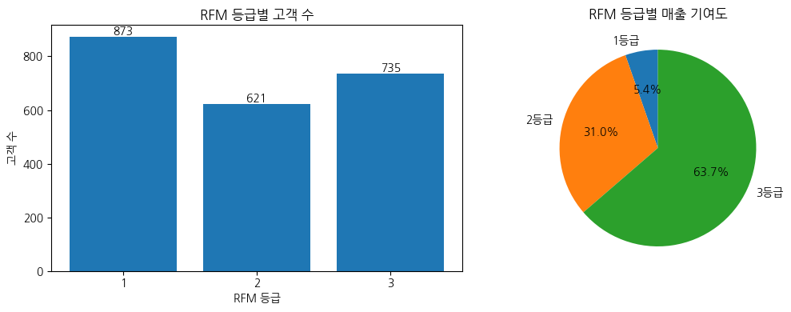
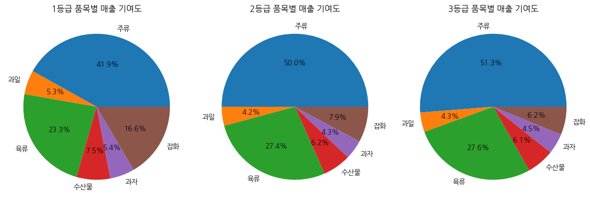
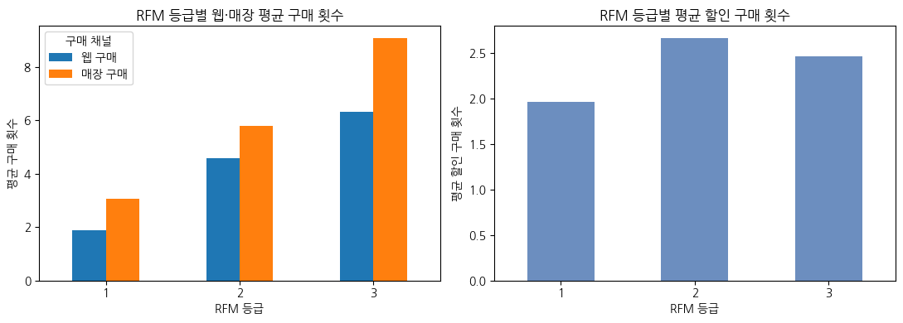
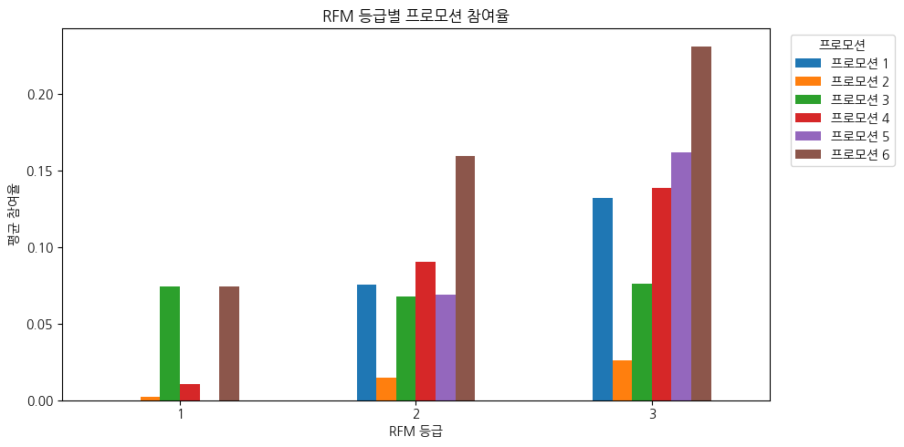

# RFM 고객 세분화 분석

온라인 고객의 구매 기록을 RFM 기준으로 나누고, 고객 등급별 구매 특성과 마케팅 활용 방향을 정리한 프로젝트입니다.

## 프로젝트 개요

- 데이터: Kaggle 고객 마케팅 데이터
- 원본 고객 수: 2,240명
- 분석 고객 수: 2,229명
- 사용 도구: Python, Pandas, Matplotlib, Seaborn, Jupyter Notebook

분석에서는 다음 세 가지를 확인했습니다.

1. 최근 구매 시점, 구매 횟수, 구매 금액을 기준으로 고객을 어떻게 구분할 수 있는가?
2. 각 고객 등급은 전체 고객 수와 매출에서 어느 정도를 차지하는가?
3. 고객 등급에 따라 품목, 구매 채널, 할인 구매, 프로모션 반응이 어떻게 달라지는가?

## 데이터 전처리

연 소득 결측값 24개는 평균으로 대체했습니다. 2023년을 기준으로 나이를 계산한 뒤 115세 이상 고객 3명을 제외했습니다. 연 소득은 IQR 기준으로 이상값 8명을 추가로 제거해 총 2,229명을 분석했습니다.

RFM 분석에 사용할 변수는 다음과 같이 만들었습니다.

- 총 구매 금액: 주류, 과일, 육류, 수산물, 과자, 잡화 구매 금액의 합
- 구매 횟수: 웹 구매 횟수와 매장 구매 횟수의 합
- 최근 구매 시점: 마지막 구매 후 경과일

할인 구매 횟수는 웹·매장 구매 횟수와 중복될 가능성이 있어 구매 횟수 계산에서 제외했습니다. 대신 고객의 할인 구매 성향을 확인하는 변수로 사용했습니다.

## RFM 고객 등급 산정

### 1. RFM 지표 정의

| 지표 | 정의 | 높은 등급의 기준 |
| --- | --- | --- |
| Recency | 마지막 구매 후 경과일 | 경과일이 짧음 |
| Frequency | 웹 구매 횟수 + 매장 구매 횟수 | 구매 횟수가 많음 |
| Monetary | 6개 품목의 구매 금액 합계 | 구매 금액이 큼 |

각 지표는 `pd.qcut`을 사용해 고객 수가 비슷한 4개 구간으로 나누고 1~4등급을 부여했습니다. Frequency와 Monetary는 값이 클수록 높은 등급을 부여했습니다. Recency는 최근에 구매한 고객이 높은 등급을 받도록 순서를 반대로 설정했습니다.

### 2. 지표별 매출 분포


Recency 등급별 매출 비중은 24.0~27.2%로 비교적 고르게 나타났습니다. 반면 Frequency 4등급은 전체 매출의 41.4%, Monetary 4등급은 61.4%를 차지했습니다. Monetary는 구매 금액으로 만든 지표이므로 높은 등급에 매출이 집중되는 것은 자연스러운 결과입니다. 이 그래프는 가중치의 정답을 정하기 위한 근거보다는 각 지표의 분포를 확인하는 용도로 사용했습니다.

### 3. 종합 RFM 등급

이 프로젝트는 매출 기여도가 높은 고객을 구분하는 데 초점을 두었습니다. 이에 따라 Recency 0.2, Frequency 0.4, Monetary 0.4의 가중치를 탐색적으로 적용했습니다.

```text
RFM 점수 = Recency 등급 × 0.2
         + Frequency 등급 × 0.4
         + Monetary 등급 × 0.4
```

가중 RFM 점수를 동일한 간격의 3개 구간으로 나누었습니다. 점수가 낮은 고객부터 1등급, 2등급, 3등급으로 구분했으며 3등급이 구매 가치가 가장 높은 고객군입니다.

## 고객 세분화 결과

### 고객 수와 매출 기여도



3등급은 전체 고객의 33.0%지만 매출의 63.7%를 차지했습니다. 1등급은 고객 수가 가장 많지만 매출 비중은 5.4%에 그쳤습니다. 고객 수보다 구매 횟수와 구매 금액의 차이가 등급별 매출 격차를 크게 만들었습니다.

| RFM 등급 | 고객 수 | 고객 비중 | 매출 비중 | 평균 Recency | 평균 구매 횟수 | 평균 구매 금액 |
| ---: | ---: | ---: | ---: | ---: | ---: | ---: |
| 1등급 | 873명 | 39.2% | 5.4% | 54.7일 | 5.0회 | 약 10.8만 원 |
| 2등급 | 621명 | 27.9% | 31.0% | 53.7일 | 10.4회 | 약 87.5만 원 |
| 3등급 | 735명 | 33.0% | 63.7% | 38.6일 | 15.4회 | 약 152.0만 원 |

### 최근 구매 시점과 구매 금액


3등급에는 최근 구매일이 가깝고 구매 금액이 큰 고객이 많이 포함됐습니다. 한편 구매 금액은 크지만 마지막 구매 후 경과일이 긴 고객도 확인됩니다. 이 고객들은 과거 구매 가치가 높았지만 최근 활동이 줄어든 고객으로 보고 재구매 유도 대상을 선정할 때 따로 살펴볼 수 있습니다.

## 고객 등급별 구매 특성

### 품목별 매출 구성



주류 매출 비중은 1등급 41.9%에서 3등급 51.3%로 높아졌습니다. 반대로 잡화 비중은 1등급 16.6%에서 3등급 6.2%로 낮아졌습니다. 세 등급 모두 주류와 육류의 비중이 높지만, 상위 등급일수록 주류 매출의 영향이 더 크게 나타났습니다.

### 구매 채널과 할인 구매



모든 등급에서 평균 매장 구매 횟수가 웹 구매 횟수보다 많았습니다. 할인 구매 횟수는 2등급이 평균 2.66회로 가장 높았고, 3등급은 평균 2.46회였습니다. 할인 구매 성향은 RFM 등급이 높아질수록 함께 증가하지 않았기 때문에 별도의 고객 특성으로 해석했습니다.

### 프로모션 참여율



3등급은 대부분의 프로모션에서 참여율이 높았습니다. 특히 프로모션 6의 참여율은 3등급에서 23.1%로 가장 높았습니다. 프로모션 3은 등급별 참여율이 6.8~7.6%로 비슷해 고객 등급에 따른 차이가 크지 않았습니다.

## 마케팅 활용 방향

- 3등급: 매출 기여도가 높고 주류 구매 비중이 크므로 VIP 혜택이나 주류 중심의 맞춤 캠페인을 우선 검토합니다.
- 2등급: 할인 구매 횟수가 가장 많으므로 할인 혜택을 활용한 상위 등급 전환 캠페인을 검토합니다.
- 구매 금액이 크지만 Recency가 긴 고객: 휴면 가능성이 있는 고가치 고객으로 분류하고 재구매 유도 캠페인 대상으로 관리합니다.

## 분석의 한계

- 거래별 구매 날짜가 없어 구매 주기와 재구매율을 계산하지 못했습니다.
- RFM 등급은 현재 데이터의 고객 분포를 기준으로 나눈 상대적인 구분입니다.
- 할인 구매가 웹·매장 구매 횟수에 포함되는지는 데이터 정의만으로 확인하기 어렵습니다.
- RFM 가중치는 분석 목적에 맞춰 탐색적으로 정한 값입니다. 실제 적용 전에는 캠페인 성과나 재구매율을 이용한 검증이 필요합니다.

## 파일 구성

```text
.
├── README.md
├── RFM_분석_포트폴리오.ipynb
├── customer_data.csv
├── requirements.txt
└── images
    ├── rfm_component_revenue_share.png
    ├── rfm_segment_channel_discount.png
    ├── rfm_segment_overview.png
    ├── rfm_segment_product_mix.png
    ├── rfm_segment_promotion_rate.png
    └── rfm_segment_recency_amount.png
```

## 실행 방법

```bash
pip install -r requirements.txt
jupyter notebook RFM_분석_포트폴리오.ipynb
```

노트북과 `customer_data.csv`를 같은 폴더에 두면 전체 분석을 실행할 수 있습니다.
